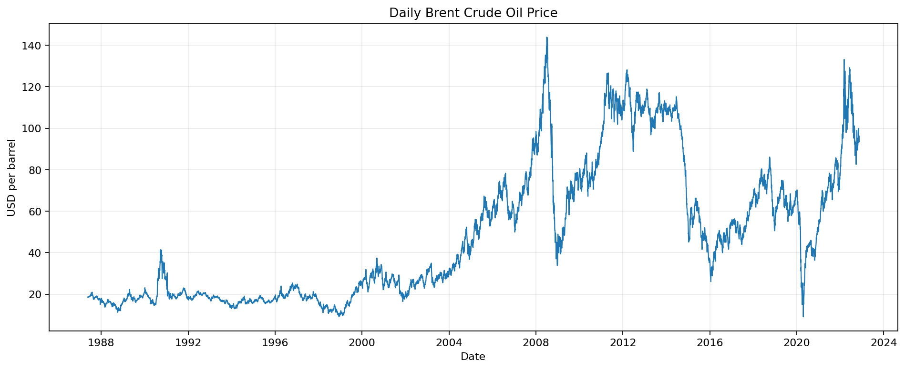
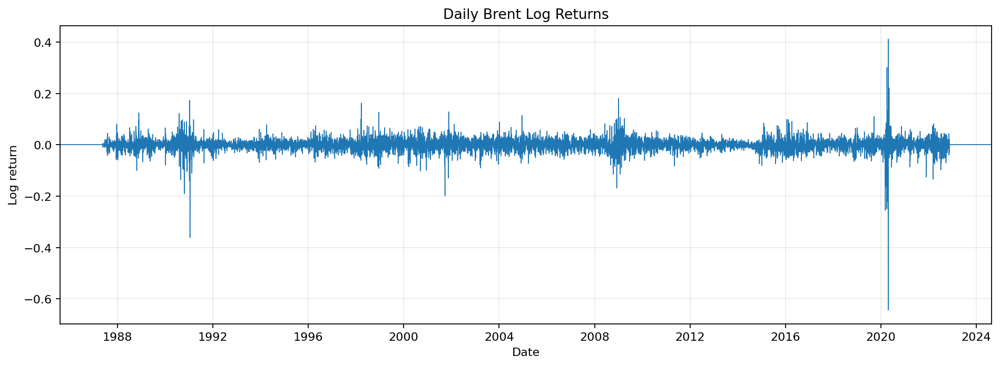
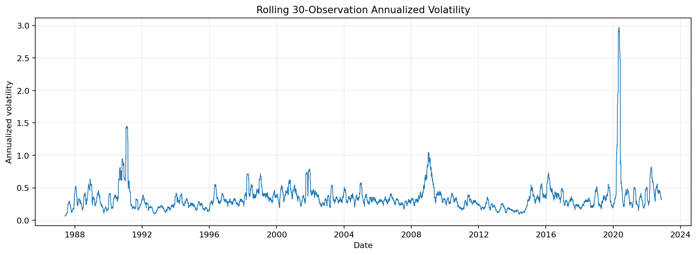
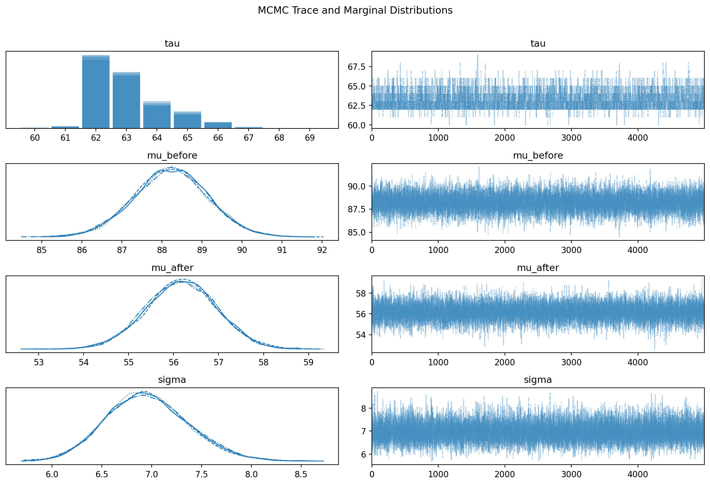
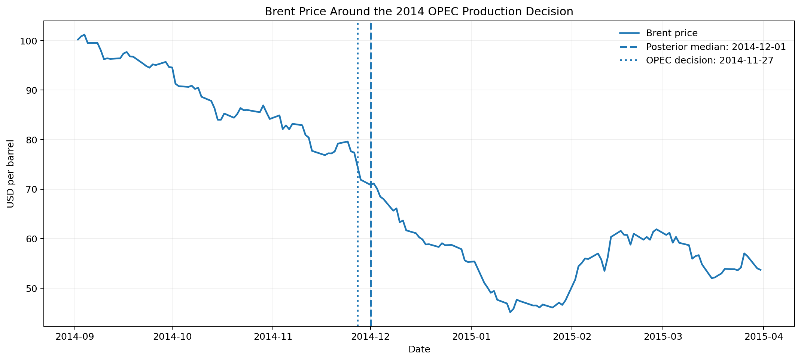
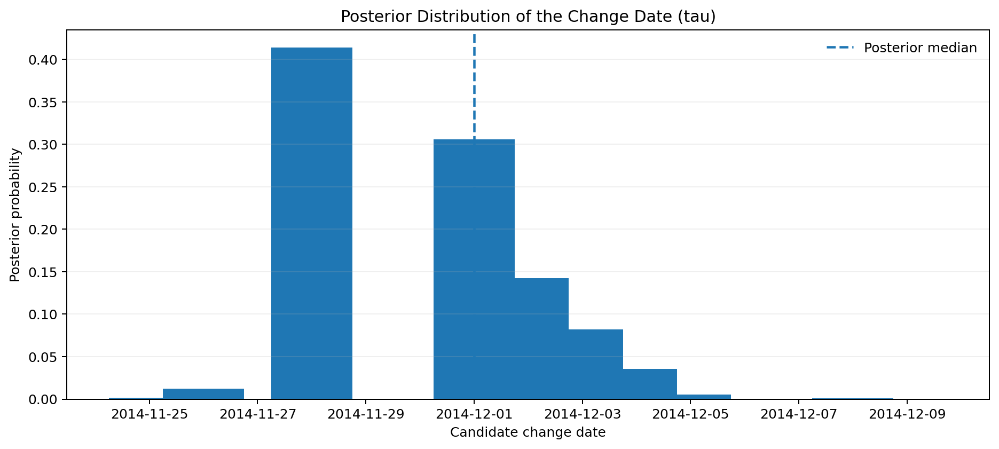
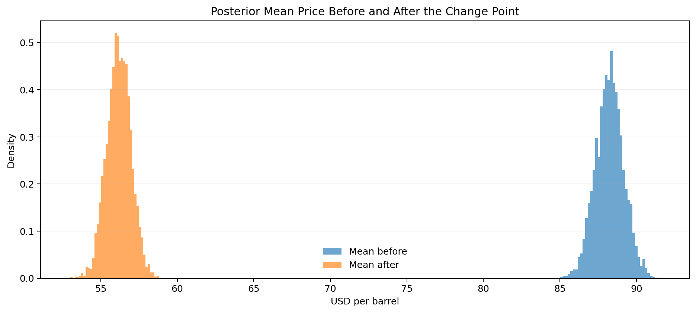
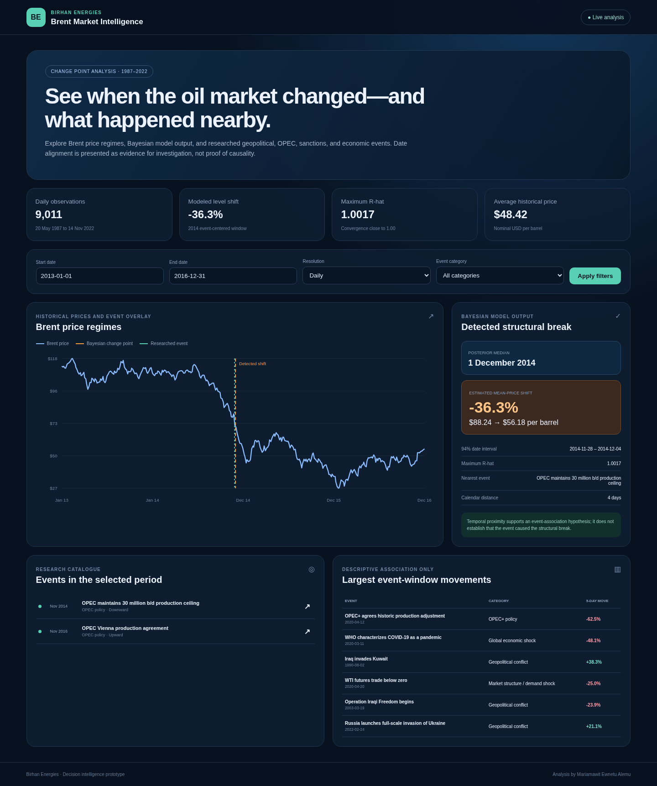
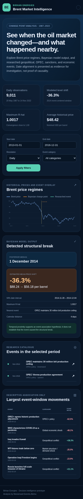

# Brent Oil Change Point Analysis and Statistical Modeling

**Author:** Mariamawit Ewnetu Alemu  
**Program:** 10 Academy — Artificial Intelligence Mastery  
**Client context:** Birhan Energies

## Executive summary

Birhan Energies needs defensible evidence about when Brent oil prices entered new statistical regimes and which geopolitical, OPEC, sanctions, supply, or economic events occurred near those shifts. This project builds a reproducible analytical pipeline from data validation and exploratory analysis to Bayesian change-point estimation and stakeholder-facing visualization.

The challenge-provided dataset contains 9,011 daily observations from 20 May 1987 to 14 November 2022. EDA shows that the raw price level is non-stationary, daily log returns are stationary, and volatility clusters during market stress. A targeted PyMC switch model identifies a structural break around 1 December 2014. The posterior mean changes from approximately $88.24 to $56.18 per barrel, a 36.3% decline. The posterior date interval lies close to OPEC's 27 November 2014 decision to maintain its production ceiling.

The date alignment is analytically useful but is not treated as proof of causal impact.

## 1. Business objective

The analysis supports three decisions:

1. Identify major structural changes in Brent oil prices and compare them with researched events.
2. Quantify the size and uncertainty of before/after price regimes using statistical methods.
3. Translate the findings into useful evidence for investors, policymakers, analysts, and energy companies.

Investors can use regime information for risk limits and scenario analysis. Policymakers can evaluate energy-security exposure and macroeconomic sensitivity. Energy companies can challenge assumptions used in budgets, procurement, supply planning, and capital allocation.

## 2. Data and event research

The repository includes the original Brent price file and a structured catalogue of 19 events. The catalogue covers geopolitical conflict, OPEC/OPEC+ policy, sanctions, financial crises, natural disasters, and the COVID-19 demand shock. Every event row includes an approximate or exact date, category, description, expected short-term pressure, and source information.

The event dates are comparison anchors. They are not automatically interpreted as treatment dates because markets may anticipate announcements, respond gradually, or react to multiple simultaneous drivers.

## 3. Exploratory time-series analysis

The raw series contains long cycles and persistent changes in level. ADF and KPSS tests jointly indicate that price levels are non-stationary. This motivates explicit structural-break analysis rather than a single constant-mean representation of the entire history.

Log returns are stationary under the same diagnostics, but their amplitude changes over time. Large positive and negative movements cluster together, particularly around the 2020 market disruption.

The rolling-volatility analysis demonstrates that a constant-variance Normal model is only a transparent baseline. More advanced work could allow variance changes, heavy tails, and multiple regimes.

## 4. Bayesian model

The required PyMC model defines:

- `tau ~ DiscreteUniform`, the unknown switch point;
- `mu_before` and `mu_after`, the mean prices on each side of the switch;
- `sigma`, the residual scale;
- `pm.math.switch`, which selects the active mean;
- a Normal likelihood connected to the observed prices.

The focused model window runs from 1 September 2014 to 31 March 2015. A focused window is used because a single `tau` cannot represent all regimes in the complete 35-year history.

MCMC sampling uses four chains, 2,000 tuning iterations, and 5,000 retained draws per chain. The maximum R-hat is 1.0017, and the minimum bulk effective sample size exceeds 2,800.

## 5. Posterior result

The posterior median change date is **1 December 2014**. The approximate 94% date interval is **28 November to 4 December 2014**.

The estimated mean price changes from **$88.24** before the switch to **$56.18** afterward. This is an estimated **36.3% decline**.

The nearest researched event is OPEC's 27 November 2014 decision to maintain a 30 million barrels-per-day production ceiling. The posterior median is four calendar days after the event, and the posterior interval begins one day after it.

This is a strong temporal alignment, not a causal proof. The decline had already begun, and competing explanations include demand expectations, U.S. shale supply, inventories, exchange rates, and market positioning.

## 6. Interactive dashboard

The Flask backend exposes historical prices, events, change-point output, event-window summaries, and headline indicators through documented endpoints. The React dashboard provides date range filters, chart resolution controls, category filters, researched-event overlays, change-point markers, event highlighting, and responsive layouts.

The model outputs saved by Task 2 are read directly by the API, ensuring that the dashboard reports the same posterior estimates as the notebook and command-line analysis.

## 7. Limitations

- One change point represents only one dominant break.
- The model assumes constant residual variance inside the selected window.
- Normal residuals may understate heavy-tailed oil-price shocks.
- Results can depend on the chosen window.
- Event dates simplify processes that may unfold over weeks or months.
- Event alignment does not control for confounding variables and does not establish causality.
- Nominal prices are not adjusted for inflation.

## 8. Future work

Future analysis can extend the model to multiple change points, Student-t errors, volatility switching, and Markov-switching regimes. External explanatory data could include inventories, production, global industrial activity, inflation, interest rates, and exchange rates. VAR or structural time-series models could investigate dynamic relationships, while causal designs would require explicit identification assumptions and appropriate comparison strategies.

## Conclusion

The project delivers a complete analytical and communication pipeline: validated price data, researched event context, EDA, Bayesian change-point estimation, convergence evidence, quantified regime change, cautious event association, tested APIs, and a responsive dashboard. The result gives Birhan Energies a transparent starting point for discussing structural oil-market risk without overstating what a date match can prove.
